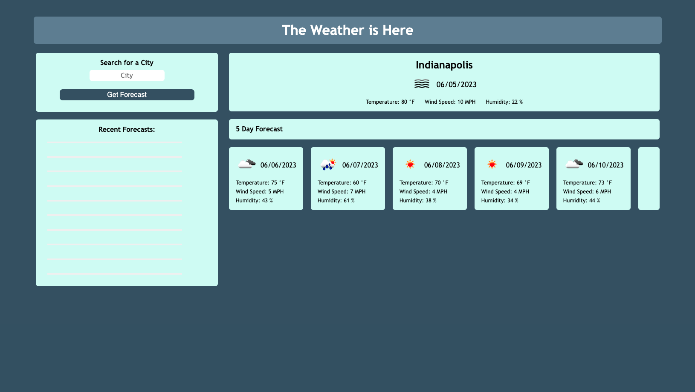

# yourNeck-of-theWoods:
## Server-Side API Weather Dashboard
This repository is used to call weather for a city for the current day as well as for a 5 day future forecast

## Usage
Upon loading up the repository in the web browser, the user will prompted to search for a city in request the weather data as well as be greeted with a fictitious entertain placeholder of a weather forecast. Additionally, the user will be presented with past searches as "recent forecasts" which can be recalled for search with a click rather than typing in the city again.
[Deployed application](https://jackieamartinez.github.io/yourNeck-of-theWoods/)

## Contributors
Consulting and guidance used in creation of this repository include peers and resources (in no order) as follows:
*   •Matt Montiel
*   •M Vincent Richards
*   •Lindsey Issac
*   •Daniel Cohen

## License
MIT License
